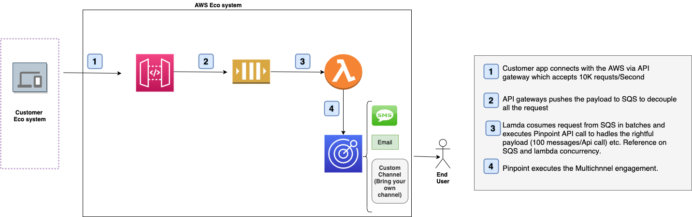

## Send-message-decoupling
### Decouple Amazon Pinpoint multi channel message sending process via APIGate way and SQS

#### Description 

Use cases(s)
* Minimal changes to the existing application code.
* Integrating Pinpoint from another Engagement applications like SFMC, AMC, Clevertap,  Webengage etc
* No avenues to authenticate with AWS via IAM role based authentication or SIGv4 authentication
* Scalability - Sending Larger API payload(> 100 recipients) as part of a single API call

#### AWS CloudFormation Link
[CF Template](api-gateway-sqs-integration.template)
